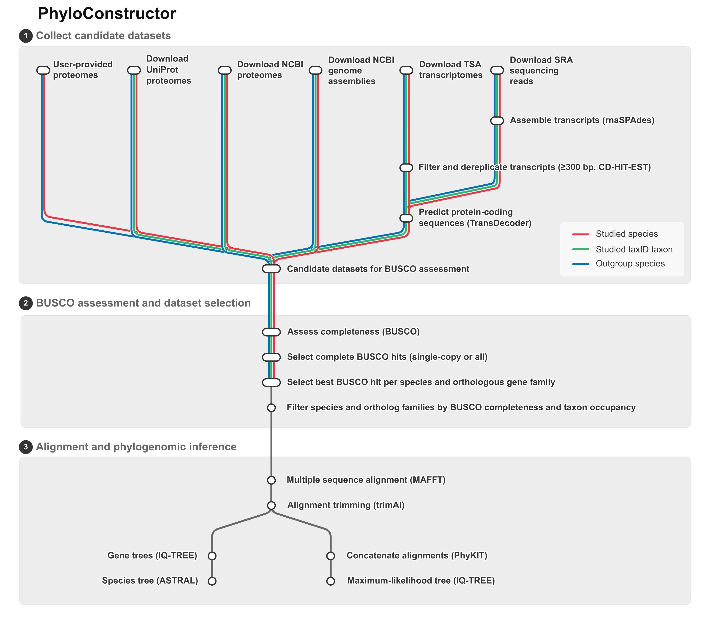

# PhyloConstructor
## A Nextflow workflow for automated phylogenomic dataset construction and species-tree inference

**PhyloConstructor** is a Nextflow DSL2 workflow for building phylogenomic datasets and inferring species trees from publicly available genomic and transcriptomic resources.

Starting from the taxonomic identifier of a clade, the workflow automatically retrieves candidate datasets from multiple public repositories, identifies orthologous genes, applies BUSCO-based filtering strategies, and reconstructs phylogenetic trees using both concatenation and coalescent approaches.

<p align="center">
  
</p>

---

# Features

* Automatic retrieval of public datasets

  * UniProt proteomes
  * NCBI RefSeq/GenBank proteomes
  * NCBI genome assemblies
  * TSA transcriptomes
  * SRA RNA-seq datasets

* Integration of user-provided proteomes

* Automatic BUSCO analysis of every candidate dataset

* Selection of the best representative dataset for each species

* Multiple BUSCO filtering strategies

* Orthogroup inference

* Construction of phylogenomic matrices

* Maximum-likelihood phylogenies with IQ-TREE

* Coalescent species trees with ASTRAL

* Fully reproducible Nextflow DSL2 workflow

---

# Requirements

* Nextflow (tested with Nextflow version 25.10.0) 
* Singularity

PhyloConstructor supports **only the Singularity execution profile**.

---

# Installation

Clone the repository:

```bash
git clone https://github.com/dorinemerlat/phyloconstructor.git
cd phyloconstructor
```

Build or download all required Singularity containers before running the workflow.

---

# Verify the installation

A quick way to verify that the workflow and all containers are correctly installed is to execute a **stub run**:

```bash
nextflow run main.nf \
    -profile singularity \
    -stub-run
```

No real analyses are performed, but every workflow component is validated.

> **Important**
>
> Before launching a real analysis, delete the output (`results/`) and cache (`cache/`) directories generated by the stub run.
>
> Stub processes create empty placeholder output files. Since Nextflow considers these files as valid outputs, they will not be overwritten during a subsequent real execution, which may lead to incorrect or incomplete results.

---

# Input files

Two CSV files are used to describe user datasets.

## group_species.csv

This file is **optional**.

It is only used to provide proteomes that are **not available in public databases**.

Example:

```text
taxid,name,fasta
4950,Torulaspora delbrueckii,/path/to/torulaspora_delbrueckii.faa
```

If no user proteomes are available, the file may simply contain the header:

```text
taxid,name,fasta
```

PhyloConstructor will then automatically search public databases.

---

## outgroups.csv

Outgroups are strongly recommended but remain optional.

Only the taxonomic identifier and species name are required.

Example:

```text
taxid,name,fasta
4932,Saccharomyces cerevisiae,
```

If a custom proteome should be used instead of downloading public data, simply provide the FASTA path:

```text
taxid,name,fasta
4932,Saccharomyces cerevisiae,/path/to/saccharomyces.faa
```

---

# Configuration

Most parameters are defined in `nextflow.config`.

## `params.group_taxid`

NCBI taxonomy identifier of the focal taxonomic group to analyse.

This taxid is used to automatically retrieve candidate datasets from public databases (UniProt, NCBI Assembly, TSA and SRA).

Example:

```groovy
group_taxid = 61985
```

---

## `params.download_uniprot`

Download reference proteomes from UniProt.

Default:

```groovy
true
```

---

## `params.download_ncbi_proteomes`

Generate proteomes from NCBI genome annotations.

If enabled, PhyloConstructor downloads annotated genome assemblies and extracts their predicted protein sequences.

Default:

```groovy
true
```

---

## `params.download_ncbi_assemblies`

Download genome assemblies from NCBI.

Genome assemblies are used for BUSCO analyses and can also serve as references when assembling transcriptomes from SRA reads.

Default:

```groovy
true
```

---

## `params.download_tsa_transcriptomes`

Download transcriptome assemblies from the NCBI Transcriptome Shotgun Assembly (TSA) database.

Downloaded transcriptomes are translated into protein sequences using TransDecoder before being evaluated by BUSCO.

Default:

```groovy
true
```

---

## `params.download_sra_reads`

Download RNA-seq datasets from the NCBI Sequence Read Archive (SRA).

Reads are assembled with RNA-SPAdes and translated into protein sequences using TransDecoder.

Default:

```groovy
true
```

---

## `params.busco_lineage`

BUSCO lineage dataset used to assess dataset completeness.

This lineage should correspond to the taxonomic group being analysed.

Example:

```groovy
busco_lineage = 'arthropoda_odb10'
```

---

## `params.busco_filtering_mode`

BUSCO filtering strategy used to retain orthologous sequences.

Available modes:

| Mode | Description |
|------|-------------|
| `only_single_copy` | Keep only complete single-copy BUSCO genes. |
| `all_complete` | Keep all complete BUSCO genes, including duplicated copies. |
| `both` | Run both filtering strategies independently. |

Default:

```groovy
params.busco_filtering_mode = 'both'
```

---

## `params.phylogeny_thresholds`

Threshold combinations used to generate phylogenomic datasets.

Each entry consists of:

```
[minimum BUSCO completeness, minimum orthogroup occupancy]
```

For example:

```groovy
params.phylogeny_thresholds = [
    [60, 80],
    [70, 80],
    [80, 90]
]
```

This example generates three independent phylogenomic datasets:

- BUSCO completeness ≥ 60% and orthogroup occupancy ≥ 80%
- BUSCO completeness ≥ 70% and orthogroup occupancy ≥ 80%
- BUSCO completeness ≥ 80% and orthogroup occupancy ≥ 90%

Each dataset is analysed independently by the phylogenetic workflow, resulting in a separate phylogenetic tree.

---

# Running the workflow

The repository contains a complete example inside the `examples/` directory.

Execute the pipeline with:

```bash
nextflow run main.nf \
    -profile singularity
```

To resume an interrupted execution:

```bash
nextflow run main.nf \
    -profile singularity \
    -resume
```

---

# BUSCO filtering strategies

Three filtering modes are available.

| Mode | Description                                                |
| ---- | ---------------------------------------------------------- |
| 1    | Keep complete single-copy BUSCO genes only                 |
| 2    | Keep all complete BUSCO genes, including duplicated copies |
| 3    | Execute both strategies independently                      |

---

# Results

Intermediate files are stored inside

```
cache/
```

Nextflow working directories are stored inside

```
work/
```

Final workflow outputs are written to

```
results/
```

At the moment, the principal outputs are:

* IQ-TREE maximum-likelihood trees
* ASTRAL species trees

---


## Credits

Originally written by Dorine Merlat (dorine.merlat@etu.unistra.fr).
Thanks to Arnaud Kress and Odile Lecompte for assistance.


# Citations

An extensive list of references for the tools used by the pipeline can be found in the [`CITATIONS.md`](CITATIONS.md) file.

---

# License

This project is distributed under the MIT License.
